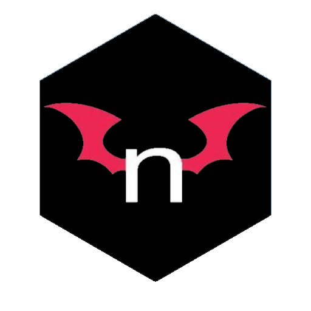

 

  

  <h3 align="center">nhentai extension</h3>

  

    simple nhentai extension for firefox
     
     
  

   

## Table Of Contents

* [Getting Started](#getting-started)
  * [Prerequisites](#prerequisites)
  * [Installation](#installation)
* [Usage](#usage)
* [License](#license)

## Getting Started

Its easy -> Download -> Use -> Profit?

### Prerequisites
FIREFOX bases Browser

Download the xx.xpi file

Set your xpi signature parameter to false(about:config)

### Installation

Move your xpi into the active Window and Install it.

## Usage

Highlight the 6 Digits and Right click.

## License

Distributed under the MIT License. See [LICENSE](https://github.com/Nyxiie/nhentai-extension-ff/blob/main/LICENSE.md) for more information.
